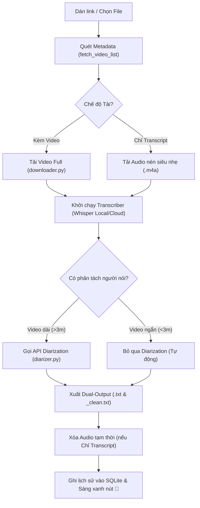

# Kiến trúc Luồng Thực thi & Đa Tiến trình (System Workflow & Multiprocessing)

Tập tin này mô tả chi tiết luồng xử lý dữ liệu và cấu trúc đa tiến trình (Multiprocessing Architecture) giúp ứng dụng hoạt động mượt mà không gây nghẽn giao diện đồ họa (GUI).

---

## 🔄 1. Luồng Xử lý Tổng quát (End-to-End Workflow)



---

## 🧵 2. Mô hình Đa tiến trình độc lập (Multiprocessing Model)

Để tránh thư viện PyTorch hoặc Whisper khóa luồng giao diện CustomTkinter chính (gây treo ứng dụng), toàn bộ lõi xử lý được chạy trên tiến trình riêng:

### Sơ đồ tương tác luồng
```
+-----------------------------------+             +-----------------------------------+
|      Tiến trình GUI (Main)        |             |    Tiến trình Xử lý (Worker)      |
|                                   |             |                                   |
| - Đọc/Ghi Settings                |             | - Gọi yt-dlp tải media            |
| - Hiển thị Danh sách / Lịch sử    |             | - Gọi PyTorch / Whisper AI        |
| - Định kỳ 0.1s quét Queue --------|--- Đọc ---->| - Tính toán Timeline              |
| - Nhận lệnh Hủy từ nút nhấn -----|--- Term. -->| - Đẩy Log / Progress vào Queue ---|
+-----------------------------------+             +-----------------------------------+
```

### Cách thức hoạt động
1. **Khởi chạy**: Khi nhấn "Bắt đầu xử lý", ứng dụng khởi tạo một tiến trình `multiprocessing.Process` độc lập chạy hàm `process_multiple_urls` từ module `src/core/processor.py`.
2. **Giao tiếp (IPC)**: Tiến trình con liên tục gửi trạng thái tiến trình (phần trăm hoàn thành, dòng log hiện tại, ngôn ngữ phát hiện) vào một `multiprocessing.Queue` dùng chung.
3. **Cập nhật UI**: Luồng GUI dùng cơ chế `app.after(100, poll_queue)` định kỳ quét Queue để lấy thông tin vẽ lên thanh tiến trình và hộp log.
4. **Hủy tức thì (Instant Terminate)**: Khi nhấn nút "Hủy Tiến Trình", luồng GUI gọi lệnh `process.terminate()` cưỡng chế hệ điều hành thu hồi tiến trình con ngay lập tức. Điều này giải phóng 100% tài nguyên CPU/VRAM trong thời gian dưới 1 giây mà không phải chờ đợi vòng lặp AI kết thúc.
